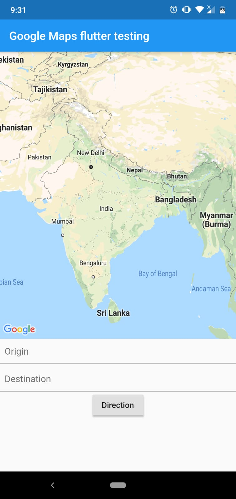
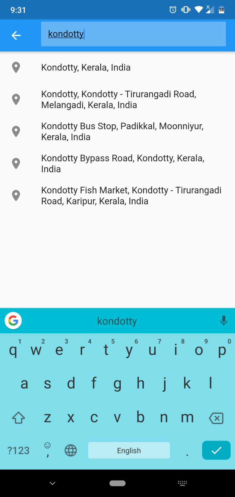
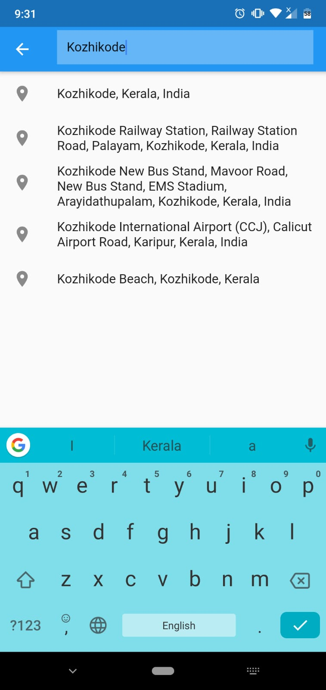
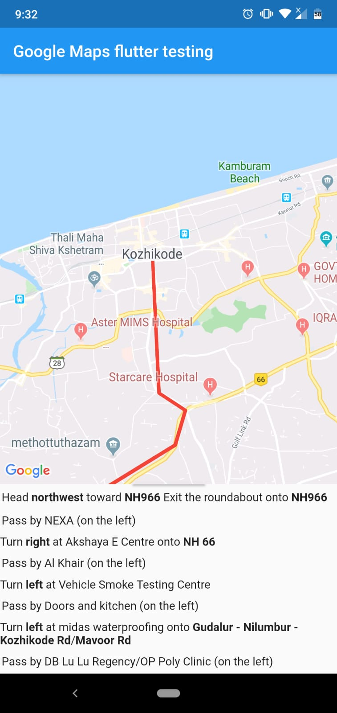

# Google Maps Direction (Flutter)

Flutter application to find directions from places

Set origin and destination. Both textfield navigate to places autocomplete search delegate.

 
   

Add `API_KEY` in manifest, AppData.dart 

